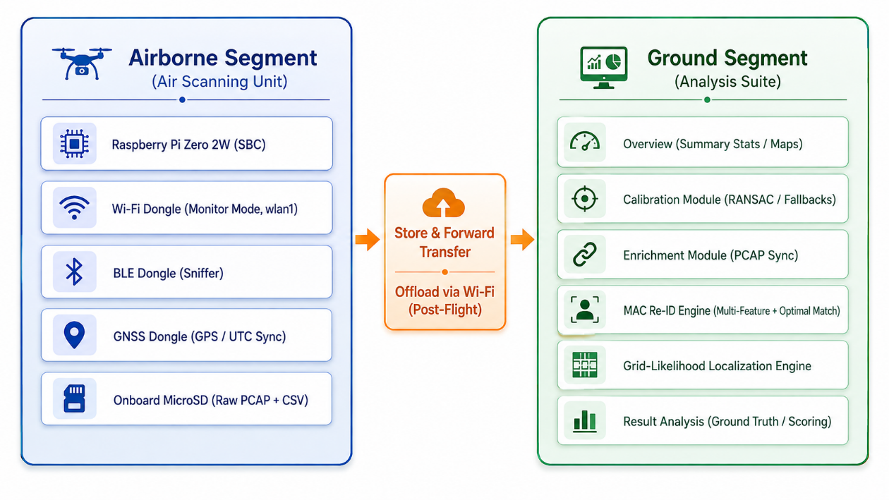
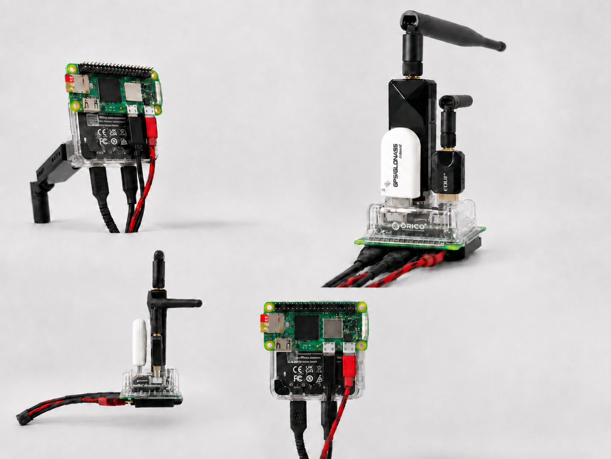
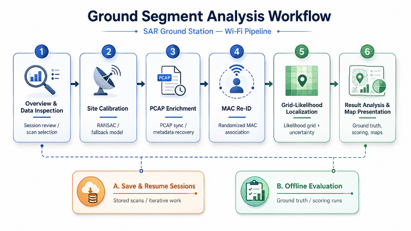
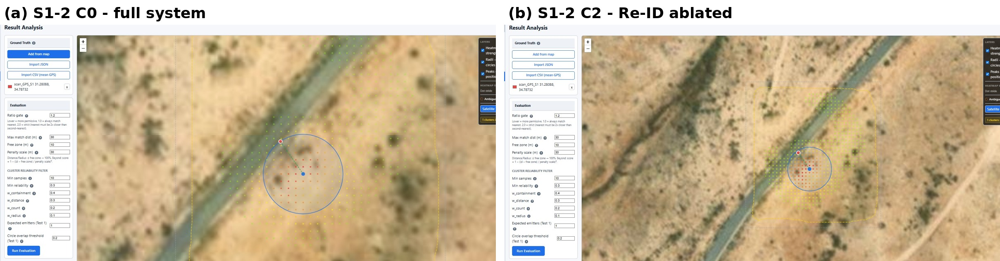
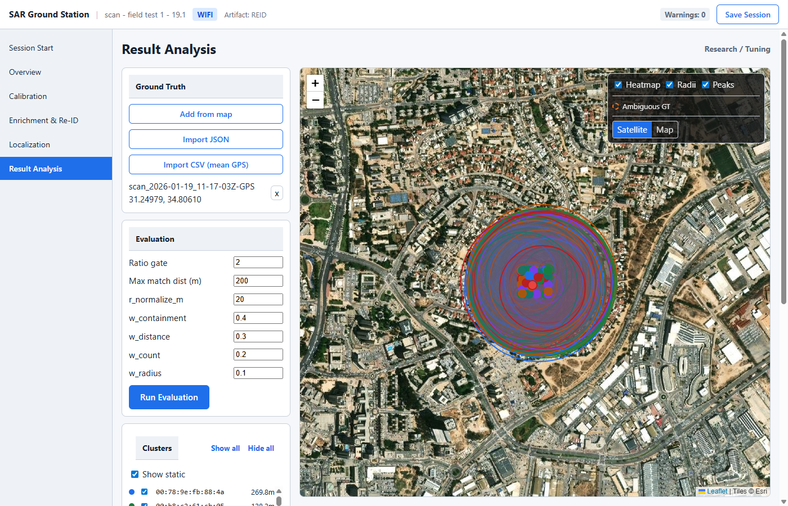

# RF-Based Scanning and Localization System for SAR

Ben-Gurion University Fourth Year Engineering Project **p-2026-078**. This system supports Search and Rescue (SAR) operations by turning **passive RF observations from personal wireless devices** (Wi-Fi, with BLE partially supported) into spatial information. A scanning unit moves through a search area collecting RF frames and GNSS positions; a ground station then processes that data into per-device location estimates with an explicit uncertainty region, so SAR teams can prioritize where to search first rather than searching the whole area uniformly.

This is not a precise indoor-positioning system, and it makes no claim of pinpointing a person's exact location — the goal is narrowing the search area using device emissions that require no cooperation from the person carrying them.

---

## Overview

```
Air Scanning Unit → RF/GNSS Acquisition → Store & Forward → Ground Station → Processing → Re-ID → Localization → Search-Area Visualization
```

| Stage | What happens |
|---|---|
| **Air Scanning Unit** | A drone/handheld-mounted Raspberry Pi captures Wi-Fi (and BLE) management frames in monitor/sniffer mode and tags them with GNSS position and timestamp. |
| **Store & Forward** | Raw CSV + PCAP data is logged locally on the unit during the mission and offloaded to the Ground Station afterward — no on-board Re-ID or localization compute. |
| **Ground Station** | A local FastAPI + React desktop application that ingests the offloaded scan folder and runs it through the processing pipeline below. |
| **Processing (Calibration → Enrichment)** | Derives per-site RF propagation parameters, then attaches PCAP-derived metadata and match diagnostics to each scan row. |
| **Re-ID** | Associates randomized/rotating MAC addresses back to the same physical device, clustering observations by `cluster_id`. |
| **Localization** | Runs a grid-likelihood estimator per cluster, producing a peak position and an uncertainty region — never just a bare point. |
| **Search-Area Visualization** | A shared map layer renders heatmap, uncertainty radii, and peaks so operators and researchers see the same result. |

**Capability status** (see the [final report](docs/fin-2026-078.pdf) §2.2, §6.6 for full detail):

- **Wi-Fi** — complete end-to-end: capture, calibration, enrichment, Re-ID, localization, and result analysis were all field-validated.
- **BLE** — capture and enrichment are implemented (the airborne unit logs BLE advertisements and the enrichment layer extracts BLE metadata), but **dynamic-address BLE Re-ID and BLE localization are not implemented** — randomized BLE identities remain singleton clusters and are outside the evaluated results.
- **Flight guidance** (adaptive scanning suggestions from live localization output) exists in the codebase (`backend/app/modules/guidance`, `airunit/guidance_sender.py`) as an experimental module, but was **not part of the field-tested acceptance milestone**.

---

## System Architecture



**Airborne Segment (Air Scanning Unit)** — a Raspberry Pi Zero 2W with a monitor-mode Wi-Fi dongle, a BLE sniffer dongle, a GNSS dongle, and onboard microSD storage. It runs a local FastAPI control app (`airunit/app.py`) plus sniffer/logger processes, and writes raw PCAP + CSV to local storage — no processing beyond capture and tagging happens in the air. See [airunit/README.md](airunit/README.md) and the [Air Unit reference copy](reference/airunit) kept for comparison.



**Store & Forward** — data is offloaded from the unit's SD card into a Ground Station scan folder (`runtime/DATA/<scan folder>/`) after the mission; there is no real-time link required during scanning.

**Ground Segment (Analysis Suite / Ground Station)** — a Python/FastAPI backend and a TypeScript/React frontend, organized as 14 bounded modules (session/state, dataset discovery, normalization, calibration, enrichment, Re-ID, localization, spatial presentation, result analysis, artifact management, save/resume, canonical models — see [Module Map](#repository-structure) below). Pages call the backend exclusively through its HTTP API; algorithm engines return data only and never render UI. The full rule set is in [CLAUDE.md](CLAUDE.md) and [docs/ARCHITECTURE.md](docs/ARCHITECTURE.md).

---

## Repository Structure

```
.
├── CLAUDE.md / AGENTS.md / CODEX.md   # AI-collaboration roles and architecture rules (read CLAUDE.md first)
├── docs/                              # Specs, architecture notes, sprint history, final/preliminary reports
│   ├── Part A.md / Part B.md / Part C.md   # Architecture, algorithms/APIs, build order — spec source of truth
│   ├── ARCHITECTURE.md, PRD.md, DECISIONS.md, SPATIAL_ENTROPY_GUIDANCE.md
│   ├── ui/UI_KIT.md                   # Frontend UI kit reference
│   ├── sprints/                       # Per-sprint indexes, todos, reports, reviews
│   ├── assets/                        # Diagrams/figures used in this README (extracted from the final report)
│   ├── fin-2026-078.pdf               # Final report (this project's official submission)
│   └── pre-2026-078.pdf               # Preliminary report (superseded by the final report)
├── airunit/                           # Air Scanning Unit software (Raspberry Pi) — Wi-Fi/BLE capture, GNSS, guidance sender
├── backend/
│   └── app/
│       ├── api/                       # FastAPI routers, one per domain (calibration, enrichment, reid, localization, ...)
│       ├── models/                    # Canonical data models (ScanRecord, EnrichedScanRecord, ReIDRecord, ...)
│       ├── modules/                   # The 14 business-logic modules (calibration, enrichment, reid, localization, guidance, ...)
│       └── storage/                   # DATA / TEMP / Saved Scans path resolution
├── frontend/
│   └── src/
│       ├── pages/                     # Workflow pages: Session Start, Overview, Calibration, Enrichment & Re-ID, Localization, Result Analysis, Air Unit, Emulator
│       ├── components/                # Shared UI: maps, charts, tables, forms, filters, layout, status
│       └── api/, state/, types/       # Backend API client, session state, shared TS types
├── tests/e2e/                         # Playwright end-to-end tests + captured screenshots
├── runtime/                           # Local runtime storage (see below) — scan data is git-ignored except placeholders
│   ├── DATA/                          # Scan folders + official artifacts (*_ENRICHED.csv, *_REID.csv) — permanent
│   ├── TEMP/                          # Non-persistent working artifacts for the active session
│   └── Saved Scans/                   # Explicit save/resume packages — persistent
├── reference/                         # Read-only reference material
│   ├── legacy_app/                    # Prior/legacy Ground Station implementation, kept for comparison only
│   └── airunit/                       # Earlier Air Unit reference copy
└── .ai/                               # Claude ↔ Codex handoff packets, review notes, decision logs (see below)
```

A few things worth knowing before navigating further:

- **Where the algorithms live:** Calibration, Enrichment, Re-ID, and Localization are each their own module under [`backend/app/modules/`](backend/app/modules) — that is the actual implementation; `docs/Part B.md` is the spec they implement.
- **Where the Ground Station UI lives:** [`frontend/src/pages/`](frontend/src/pages), one page per pipeline stage, calling the backend API only (no algorithm logic in the frontend — see [Architecture Rules](CLAUDE.md#architecture-rules--never-violate)).
- **Where experimental data lives:** [`runtime/DATA/`](runtime/DATA) holds the captured scan folders used through this project's field campaign (raw CSV/PCAP plus official `_ENRICHED`/`_REID` artifacts); [`runtime/Saved Scans/`](<runtime/Saved Scans>) holds saved analysis sessions from that campaign, including the ablation runs (`_C0`…`_C3` naming) discussed in the final report.
- **Why `reference/legacy_app` and `airunit` both exist:** this project is a ground-up refactor of an earlier working prototype. The legacy app is kept, unmodified, purely as behavioral reference (see [reference/legacy_app/README.md](reference/legacy_app/README.md)); it is not part of the current system and is out of scope for changes.
- **`.ai/`** contains the file-based handoff protocol used between the Claude (supervisor/reviewer) and Codex (implementer) roles during development — see [docs/AI_COLLABORATION.md](docs/AI_COLLABORATION.md) if you want to understand how the codebase was actually built, not just what it does.

---

## Software / Processing Pipeline



1. **Overview** — inspect a selected scan CSV: stats, charts, preview table, spatial view. No algorithmic processing.
2. **Calibration** — derive per-site RF propagation parameters (RANSAC fit against a chosen calibration CSV/MAC), with fallback theoretical presets when derivation isn't possible; parameters must be explicitly approved before use downstream.
3. **Enrichment** — matches each CSV row's scan record to its corresponding PCAP frame and attaches protocol-specific metadata plus match diagnostics (`match_found`, `match_delta_ms`, `match_score`, `match_method`). Requires a PCAP with the same basename as the selected CSV. Output is an official `*_ENRICHED.csv` artifact.
4. **Re-ID** — resolves randomized/rotating MAC addresses back to the same physical device using a weighted signature matcher with optimal one-to-one assignment, clustering rows by `cluster_id` and labeling each cluster `static` or `dynamic`. Output is an official `*_REID.csv` artifact.
5. **Localization** — runs a deterministic grid-likelihood engine per cluster over the REID data (full set or a filtered subset), returning a heatmap/grid, a primary peak, candidate peaks, and an uncertainty region per successful cluster. Rendering is handled entirely by the shared map layer, not by the engine.
6. **Result Analysis / Visualization** — for the research workflow: import ground truth, score localization results (containment, distance, count, radius), and rerun only the pipeline stages a changed parameter actually affects (see the [Rerun Rules](CLAUDE.md#rerun-rules)).

Official artifacts (`*_ENRICHED.csv`, `*_REID.csv`) found in a scan folder are first-class inputs — the Ground Station lets you jump directly to the relevant stage instead of re-deriving them. Deeper algorithm-level detail (parameters, formulas, TBDs) is in [docs/Part B.md](<docs/Part B.md>); the as-implemented and as-measured version is in the [final report](docs/fin-2026-078.pdf) §2.4 and §4.

---

## Running / Using the Project

### Ground Station (backend + frontend)

```bash
# 1. Copy and configure environment
cp .env.example .env

# 2. Backend (terminal 1)
cd backend
pip install -r requirements.txt
uvicorn app.main:app --reload --host 0.0.0.0 --port 8000

# 3. Frontend (terminal 2)
cd frontend
npm install
npm run dev

# 4. Tests
cd backend && pytest
npx playwright test
```

| Service | Default port | Controlled by env var |
|---|---|---|
| Backend | 8000 | `BACKEND_PORT` |
| Frontend | 5173 | `FRONTEND_PORT` |

Copy scan folders into `runtime/DATA/` before starting a session — see [runtime/README.md](runtime/README.md).

For **live mission mode** (an Air Unit connecting to this laptop over the local network), the backend must be started with `--host 0.0.0.0`, not bound to `127.0.0.1`/`localhost`, or the Air Unit cannot reach the Ground Station at the laptop's LAN IP.

### Air Unit

The Air Unit runs on a Raspberry Pi and is deployed/updated separately from the Ground Station — see [airunit/README.md](airunit/README.md) for first-time setup (`install.sh`), day-to-day deploy (`deploy.sh`), and the systemd services involved. Air Unit hardware setup and physical assembly are hardware-specific and are documented narratively in the [final report](docs/fin-2026-078.pdf) §3.4 and §8.2, not fully reproducible from the repository alone.

### Offline Processing / Analysis

The Result Analysis workflow (ground truth comparison, scoring, parameter reruns) operates entirely on already-captured data in `runtime/DATA/` / `runtime/Saved Scans/` and does not require an Air Unit — start the Ground Station as above and open a saved or in-progress session.

---

## Experimental Material

This project's field campaign comprised **five independent outdoor captures** (Wi-Fi) evaluated across a **C0–C3 ablation matrix** (full system, calibration-ablated, Re-ID-ablated, and combined) — see the final report §4.4–§4.6 for the full methodology and results.

- **Raw and processed scan data:** [`runtime/DATA/`](runtime/DATA) — raw CSV/PCAP captures plus official `_ENRICHED`/`_REID` artifacts per scan folder.
- **Saved analysis sessions:** [`runtime/Saved Scans/`](<runtime/Saved Scans>) — persisted Result Analysis sessions, including the `_C0`/`_C1`/`_C2`/`_C3` ablation runs referenced in the report.
- **E2E test screenshots:** [`tests/e2e/screenshots/`](tests/e2e/screenshots) — captured from Playwright runs against the live Ground Station UI.
- **Result figures and diagrams:** [`docs/assets/`](docs/assets) — figures extracted from the final report and used in this README.

Example ablation comparison (full system vs. Re-ID disabled — with Re-ID removed, a genuinely multi-emitter scenario collapses to a single reported emitter):



Ground Station Result Analysis view, showing localization output (heatmap, uncertainty radii, peaks) against imported ground truth:



**Headline measured results** (full detail in the final report §4.6 and §6.3): across the five full-system (C0) captures, emitter count was correct in every scenario with no false positives; median localization error was 11.04 m against a 10 m target; 10 of 11 placed targets (90.9%) fell within their reported uncertainty region; mean uncertainty radius was 18.05 m against a 10 m sharpness target (approached, not achieved). These numbers describe the specific campaign and hardware in this repository, not a general performance guarantee.

---

## Project Resources

- [Final Report](docs/fin-2026-078.pdf) — the official final submission for this project. Source of truth for methodology, results, and figures.
- [Preliminary Report](docs/pre-2026-078.pdf) — earlier design-stage report, superseded by the final report above.
- [Demonstration Video](https://www.youtube.com/watch?v=8ebjfqGwJrk)
- [System Architecture Diagram](docs/assets/system_architecture.png) · [Processing Pipeline Diagram](docs/assets/processing_pipeline.png) · [Air Scanning Unit Hardware](docs/assets/air_scanning_unit.png)
- [docs/Part A.md](<docs/Part A.md>) · [docs/Part B.md](<docs/Part B.md>) · [docs/Part C.md](<docs/Part C.md>) — architecture, algorithms/APIs, and build-order specs
- [docs/ARCHITECTURE.md](docs/ARCHITECTURE.md) — condensed technical architecture reference
- [docs/AI_COLLABORATION.md](docs/AI_COLLABORATION.md) — how Claude/Codex collaboration was used to build this repository

---

## Acknowledgments

We would like to thank Prof. Chen Avin for his guidance, encouragement, and support throughout the project. His willingness to let us explore, challenge assumptions, and take the project in ambitious directions made this work both valuable and genuinely enjoyable for us.

A short demonstration video of the completed system is available [here](https://www.youtube.com/watch?v=8ebjfqGwJrk).


---

## Development Reference (AI Collaboration, Commands, Slash Commands)

The sections below are retained from the project's working README for anyone continuing development on this codebase.

### Commands

```bash
# Backend
cd backend && uvicorn app.main:app --reload     # Dev server (port 8000)
cd backend && pytest                            # All backend tests
cd backend && pytest tests/unit/               # Unit tests only
cd backend && pytest tests/integration/        # Integration tests only

# Frontend
cd frontend && npm run dev                     # Dev server (port 5173)
cd frontend && npm run build                   # Production build
cd frontend && npm test                        # Frontend unit tests

# E2E
npx playwright test                            # All E2E tests
npx playwright test --ui                       # Interactive mode
npx playwright test --debug                    # Debug mode
```

### Slash Commands

| Command | Role | Use When |
|---|---|---|
| `/project:cto` | CTO | Architecture decisions, module design, code review |
| `/project:dev:backend` | DEV — Backend | FastAPI endpoints, Python modules, data models |
| `/project:dev:frontend` | DEV — Frontend | React pages, components, state, API integration |
| `/project:dev:algo` | DEV — Algorithms | Calibration, Enrichment, Re-ID, Localization engines |
| `/project:qa` | QA | Testing, regression checks, spec compliance |
| `/project:plan` | — | Force planning before complex work |
| `/project:codex-handoff` | — | Prepare a handoff packet for Codex |

### AI Collaboration

Claude and Codex worked together via file-based handoffs during development. See [docs/AI_COLLABORATION.md](docs/AI_COLLABORATION.md).

- **Claude** supervises: architecture review, spec compliance, QA, task planning
- **Codex** implements: writes code, runs tests, fixes review findings

Handoff files live in `.ai/`:
- `.ai/handoffs/current.md` — Claude → Codex work packet
- `.ai/codex_result.md` — Codex → Claude review request
- `.ai/reviews/claude_review.md` — Claude → Codex review findings

### Spec

All behavior is defined in `docs/Part A.md` and `docs/Part B.md`. Build order is in `docs/Part C.md`.
